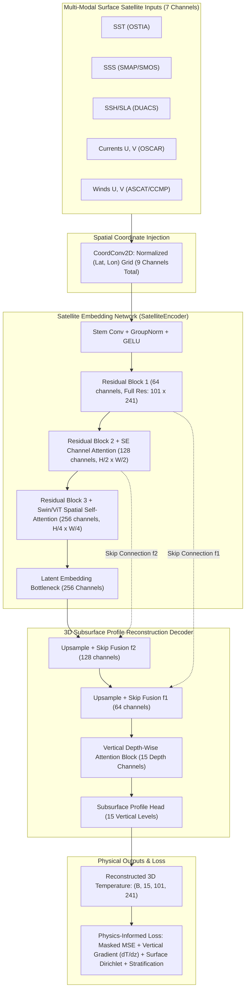

# OceanEmbed: Satellite Embedding-Based Deep Learning Framework for Subsurface Ocean Temperature Reconstruction

[](https://pytorch.org)
[](https://python.org)
[](https://sih.gov.in)
[]()
[]()

> **Smart India Hackathon (SIH) Problem Statement ID:** `26066`  
> **Problem Statement Title:** OceanEmbed - Satellite Embedding-Based Deep Learning Framework for Reconstruction of Subsurface Ocean Temperature from Surface Satellite Observations  
> **Organization:** Ministry of Earth Sciences (MoES) / Indian National Centre for Ocean Information Services (INCOIS)

---

## 1. Executive Summary & Scientific Background

### The Oceanographic Challenge
Subsurface ocean temperature is a fundamental physical variable governing ocean heat content (OHC), tropical cyclone heat potential (TCHP), stratification, thermocline displacement, and air-sea interaction. In the **North Indian Ocean (5°N to 30°N, 45°E to 105°E)**—comprising the Arabian Sea and the Bay of Bengal—subsurface thermal variability critically influences the **Indian Summer Monsoon**, extreme tropical cyclone intensification, and catastrophic marine heatwaves.

However, direct vertical in-situ observations (primarily from autonomous ARGO floats, RAMA moored buoys, and shipboard CTD casts) are sparse in space and time (typically ~3° × 3° spatial spacing sampled only once every 10 days).

### The Physical Principle: Surface-to-Subsurface Teleconnections
In contrast, satellite remote sensing provides continuous, high-resolution daily observations of the sea surface. Physical ocean dynamics provide strong non-linear couplings connecting surface signatures to subsurface stratification:
1. **Sea Surface Height (SSH) / Sea Level Anomaly (SLA):** Directly correlates with vertical thermocline displacement via baroclinic mode dynamics. Cyclonic eddies lift the cold thermocline (negative SSH anomaly), whereas anticyclonic eddies depress the warm upper layer (positive SSH anomaly).
2. **Sea Surface Temperature (SST):** Constrains upper mixed-layer heat budget, surface boundary conditions, and upwelling signatures (e.g. Somali & Oman coastal upwelling).
3. **Sea Surface Salinity (SSS):** Crucial in the northern Bay of Bengal where massive freshwater runoff from the Ganga-Brahmaputra river system creates strong vertical salinity stratification and shallow barrier layers, decoupling surface SST from deeper thermocline variations.
4. **Surface Ocean Currents $(U, V)$:** Account for horizontal advective heat transport, boundary currents (East India Coastal Current, West India Coastal Current), and eddy kinetic energy.
5. **Surface Winds $(U, V)$:** Drive Ekman transport, wind-stress curl, turbulent mixed-layer deepening, and coastal upwelling/downwelling.

`OceanEmbed` solves this inverse problem by projecting multi-modal surface satellite observations into a rich **256-channel latent satellite embedding space**, which is subsequently decoded into continuous **3D subsurface temperature fields** across 15 standard vertical depths at **0.25° × 0.25° daily resolution**.

---

## 2. System Specifications

| Parameter | Specification | Details |
| :--- | :--- | :--- |
| **Geographic Domain** | North Indian Ocean (NIO) | Latitude: 5.0°N to 30.0°N, Longitude: 45.0°E to 105.0°E |
| **Spatial Resolution** | 0.25° × 0.25° Grid | $101 \times 241$ spatial grid points (~28 km cell size) |
| **Temporal Resolution** | Daily | Single-snapshot and temporal sliding window support |
| **Vertical Levels** | 15 Standard Depths | `[0, 5, 10, 20, 30, 50, 75, 100, 125, 150, 200, 300, 500, 700, 1000]` meters |
| **Input Channels (7)** | Multi-Modal Surface Fields | SST (OSTIA), SSS (SMAP/SMOS), SSH (DUACS), Currents $(U,V)$ (OSCAR), Winds $(U,V)$ (ASCAT/CCMP) |
| **Training Target** | GLORYS12V1 Reanalysis | 3D daily temperature reanalysis ($1/12^\circ$ interpolated to $0.25^\circ$) |
| **Validation Dataset** | Independent In-Situ ARGO | INCOIS Live Access Server (LAS) Gridded ARGO and profile observations |

---

## 3. End-to-End Deep Learning Architecture



### Key Architectural Innovations

1. **CoordConv Positional Injection:**
   Physical ocean fluid dynamics are fundamentally governed by the latitude-dependent Coriolis parameter $f = 2\Omega\sin\phi$. Translation-invariant CNNs cannot inherently discern whether an eddy feature is at 6°N (near-equatorial) or 24°N (subtropical). CoordConv explicitly provides geographic coordinates to preserve geostrophic balance.

2. **Squeeze-and-Excitation (SE) Dynamic Multi-Modal Attention:**
   Dynamically recalibrates the relative weighting of input channels. In the northern Bay of Bengal, the network learns to attend heavily to SSS due to river runoff; in mesoscale eddy fields, it prioritizes SSH.

3. **Spatial Window Self-Attention (Swin/ViT-inspired):**
   Captures basin-scale teleconnections and planetary wave dynamics (westward-propagating Rossby waves and coastal Kelvin waves) across hundreds of kilometers.

4. **Vertical Depth-Wise Attention:**
   Rather than treating the 15 depth levels as independent channels, the `DepthAttentionBlock` explicitly models vertical layer coupling across the Mixed Layer (0–50m), the Thermocline (50–200m), and the Deep Ocean (200–1000m).

---

## 4. Physics-Informed Multi-Objective Loss Formulation

Naive MSE loss leads to over-smoothing, blunting the sharpness of the thermocline and introducing unphysical vertical inversions. `OceanEmbed` employs a physics-informed multi-objective loss:

$$\mathcal{L}_{\text{total}} = \lambda_{\text{mse}} \mathcal{L}_{\text{mse}} + \lambda_{\text{grad}} \mathcal{L}_{\text{grad}} + \lambda_{\text{surf}} \mathcal{L}_{\text{surf}} + \lambda_{\text{strat}} \mathcal{L}_{\text{strat}}$$

1. **Masked MSE ($\mathcal{L}_{\text{mse}}$):**
   $$\mathcal{L}_{\text{mse}} = \frac{1}{|\Omega_{\text{ocean}}|} \sum_{(i,j) \in \Omega_{\text{ocean}}} \sum_{k=1}^{15} \left( T_{\text{pred}}(z_k, i, j) - T_{\text{true}}(z_k, i, j) \right)^2$$
   Excludes all land pixels to eliminate coastal artifacts.

2. **Vertical Thermal Gradient Loss ($\mathcal{L}_{\text{grad}}$):**
   $$\mathcal{L}_{\text{grad}} = \frac{1}{|\Omega_{\text{ocean}}|} \sum_{(i,j) \in \Omega_{\text{ocean}}} \sum_{k=1}^{14} \left( \frac{T_{\text{pred}}(z_{k+1}) - T_{\text{pred}}(z_k)}{\Delta z_k} - \frac{T_{\text{true}}(z_{k+1}) - T_{\text{true}}(z_k)}{\Delta z_k} \right)^2$$
   Enforces sharp thermocline slopes ($\partial T / \partial z$) and accurate $20^\circ\text{C}$ isotherm depth ($D_{20}$) reconstruction.

3. **Surface Dirichlet Consistency ($\mathcal{L}_{\text{surf}}$):**
   $$\mathcal{L}_{\text{surf}} = \frac{1}{|\Omega_{\text{ocean}}|} \sum_{(i,j) \in \Omega_{\text{ocean}}} \left( T_{\text{pred}}(z=0\text{m}, i, j) - \text{SST}_{\text{input}}(i, j) \right)^2$$
   Guarantees that the surface layer prediction strictly honors satellite SST measurements.

4. **Monotonic Stratification Stability Penalty ($\mathcal{L}_{\text{strat}}$):**
   Penalizes unphysical non-monotonic inversions:
   $$\mathcal{L}_{\text{strat}} = \frac{1}{|\Omega_{\text{ocean}}|} \sum_{(i,j) \in \Omega_{\text{ocean}}} \sum_{k=1}^{14} \left[ \max\left(0, T_{\text{pred}}(z_{k+1}) - T_{\text{pred}}(z_k) - \tau \right) \right]^2$$

---

## 5. Repository Structure

```text
OceanEmbed/
├── configs/
│   └── default.yaml             # Domain bounds, model hyperparameters, loss weights
├── data/
│   ├── raw/                     # Raw satellite NetCDF files (OSTIA, SMAP, DUACS, etc.)
│   └── processed/               # Preprocessed, harmonized & land-masked arrays
├── src/
│   ├── __init__.py
│   ├── data/
│   │   ├── __init__.py
│   │   ├── preprocess.py        # Harmonization, 0.25° regridding, NIO land mask, synthetic generator
│   │   └── dataset.py           # PyTorch Dataset, CoordConv injection, DataLoaders
│   ├── models/
│   │   ├── __init__.py
│   │   ├── encoder.py           # Latent Satellite Embedding Network (Swin-ViT / 2D-CNN)
│   │   ├── decoder.py           # 3D Depth Profile Reconstruction Decoder with Depth Attention
│   │   └── oceanembed_net.py    # Complete End-to-End Model Wrapper & Embedding Extractor
│   ├── utils/
│   │   ├── __init__.py
│   │   ├── losses.py            # Physics-informed MSE + Vertical Thermal Gradient Loss
│   │   └── metrics.py           # Depth-wise RMSE, Pearson r, Mean Bias, MAE, D20 Error
├── train.py                     # Clean training loop with AMP mixed precision & checkpointing
├── evaluate.py                  # Independent ARGO Float Validation & diagnostic profile plotting
├── requirements.txt             # PyTorch and scientific computing dependencies
└── README.md                    # Technical documentation
```

---

## 6. Quickstart Guide

### 1. Installation
Clone the repository and install the dependencies:
```bash
git clone https://github.com/your-org/OceanEmbed.git
cd OceanEmbed
pip install -r requirements.txt
```

### 2. Data Harmonization & Preprocessing
To harmonize real raw satellite NetCDF datasets or generate an immediate physically consistent North Indian Ocean benchmark dataset:
```bash
python -m src.data.preprocess
```
This generates:
- `train_data.npz`, `val_data.npz`, `test_data.npz`
- `ocean_land_mask.npy` (High-fidelity North Indian Ocean land mask)
- `argo_observations.npy` (Independent ARGO float in-situ profiles)

### 3. Model Training
Train `OceanEmbed` using the default YAML configuration:
```bash
python train.py --config configs/default.yaml --epochs 50 --batch_size 8
```
Key features:
- Automatically utilizes CUDA GPU if available (with Automatic Mixed Precision `torch.amp`).
- Employs AdamW optimizer + Cosine Annealing learning rate schedule.
- Saves the best checkpoint based on validation RMSE to `checkpoints/oceanembed_best.pt`.

### 4. Evaluation & In-Situ ARGO Float Validation
Run full evaluation against test reanalysis data and independent ARGO float observations:
```bash
python evaluate.py --config configs/default.yaml
```

The evaluation script generates:
1. `outputs/vertical_profiles_comparison.png`: Vertical temperature profiles comparing GLORYS target, OceanEmbed prediction, and in-situ ARGO floats across key North Indian Ocean regions.
2. `outputs/depth_wise_skill_metrics.png`: Depth-wise RMSE, Pearson correlation ($r$), and Mean Bias Error curves from 0m down to 1000m.
3. `outputs/horizontal_temperature_slices.png`: 2D spatial maps of target, prediction, and absolute error at 0m, 100m (thermocline), 300m, and 1000m.
4. `outputs/evaluation_report.json`: Quantitative metrics saved as JSON.

---

## 7. Downstream Oceanographic Applications

The compact 256-channel satellite embeddings learned by `OceanEmbed` can be extracted directly via `model.extract_embeddings(x)` and applied to:
- **Tropical Cyclone Intensity Forecasting:** Calculating Tropical Cyclone Heat Potential ($\text{TCHP} = c_p \rho \int_{D26}^0 (T - 26)\, dz$) to predict rapid intensification in the Bay of Bengal.
- **Subsurface Marine Heatwaves (MHWs):** Detecting subsurface thermal anomalies that persist below the mixed layer unseen by surface satellites.
- **Ocean Data Assimilation:** Providing high-resolution 3D background priors for numerical ocean circulation models (e.g. MOM6, ROMS).
- **Fisheries Habitat Suitability:** Mapping thermocline shoaling and upwelling zones associated with pelagic fish aggregation.
